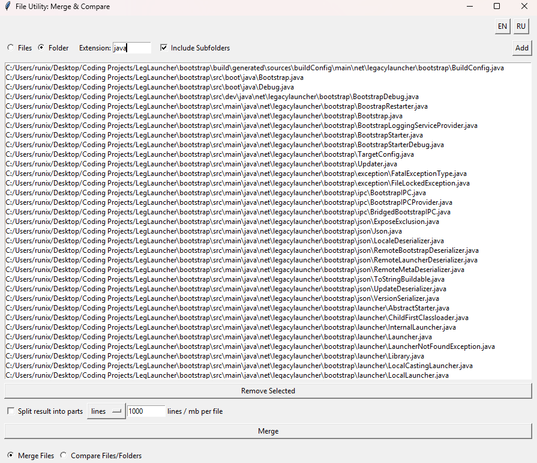
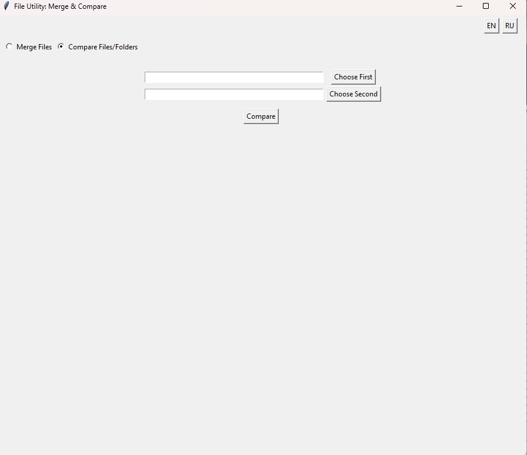

# FileUtilityApp

Утилита для удобного объединения и сравнения файлов и папок на базе Tkinter. Работает на Windows и может быть на macOS и Linux.

## Возможности

- Объединение множества файлов или всех файлов в выбранной папке  
- Фильтрация по расширению и рекурсивный обход подпапок  
- Опциональное разбиение результата по числу строк или размеру (МБ)  
- Сравнение двух файлов побайтово  
- Сравнение двух папок с выводом отличающихся, отсутствующих и дополнительных файлов, а также рекурсивный обход подпапок  

---

## Требования

- Python 3.6 и выше  
- Библиотека `tkinter` (обычно входит в стандартную поставку Python)  
- Стандартные модули `os` и `filecmp`  

---

## Установка

1. Склонируйте репозиторий:
   ```bash
   git clone https://github.com/<ваш-username>/file-utility-app.git
   cd file-utility-app
   ```

2. Создайте и активируйте виртуальное окружение:

   Linux/macOS:
   ```bash
   python3 -m venv venv
   source venv/bin/activate
   ```

   Windows (PowerShell):
   ```powershell
   python -m venv venv
   venv\Scripts\activate
   ```

3. Установите зависимости (если нужны дополнительные пакеты):
   ```bash
   pip install -r requirements.txt
   ```
   > В текущей версии дополнительных пакетов нет — `tkinter`, `os` и `filecmp` входят в стандартную библиотеку.

---

## Запуск

```bash
python fff.txt
```

Если вы переименовали файл, например, в `file_utility_app.py`:
```bash
python file_utility_app.py
```

---

## Использование

### Режим «Объединить файлы»

1. Выберите переключатель «Объединить файлы».  
2. В блоке «Файлы/Папка» выберите, что именно вы хотите добавить:
   - **Файлы** — открывается диалог выбора отдельных файлов.
   - **Папка** — открывается дерево каталога с возможностью фильтрации по расширению и рекурсией.
3. При желании задайте расширение файлов и включите «Включая подпапки».  
4. Добавьте файлы в список, удалите лишние кнопкой «Удалить выбранные».  
5. Для разбиения результата поставьте флажок «Разделить результат на части», укажите «lines» (строки) или «mb» (мегабайты) и количество.  
6. Нажмите кнопку **Объединить** и укажите имя выходного файла.

### Режим «Сравнить файлы/папки»

1. Переключитесь на «Сравнить файлы/папки».  
2. Кнопками «Выбрать первое» и «Выбрать второе» укажите два пути (файлы или папки).  
3. Нажмите **Сравнить**.  
4. Результат (идентичны или перечень отличий) отобразится в текстовой области.

---

## Скриншоты

  


---